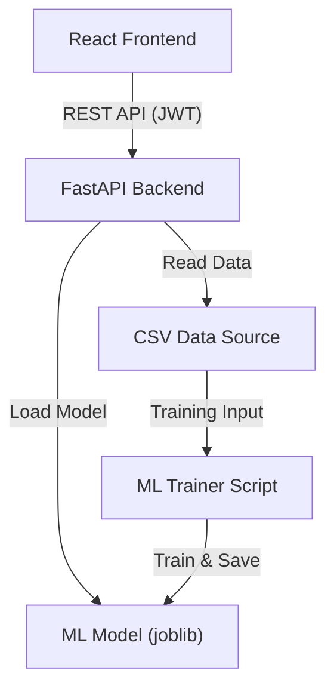

# Mini AI Sales Prediction System

Sistem mini untuk mengelola data penjualan dan memprediksi status produk (**Laris / Tidak Laris**) menggunakan Machine Learning (Random Forest).

## 🏗️ Arsitektur Sistem

Sistem ini dibangun dengan arsitektur **Decoupled Fullstack** yang memisahkan Frontend dan Backend secara modular.



### Penjelasan Alur Data:

1.  **Otentikasi**: User melakukan login melalui React. Backend memvalidasi kredensial (dummy) dan memberikan **JWT Token**.
2.  **Tabel Penjualan**: Frontend mengambil data dari endpoint `/api/sales` yang membaca file `sales_data.csv`. Data dikirim secara paginated (per halaman) untuk efisiensi memory.
3.  **Prediksi ML**: User memasukkan data produk (jumlah, harga, diskon) ke form. Backend memuat model Random Forest yang sudah dilatih dan mengembalikan hasil klasifikasi (**Laris/Tidak Laris**) beserta skor keyakinannya.

---

## 📦 Tech Stack

| Komponen       | Teknologi                                              |
| -------------- | ------------------------------------------------------ |
| **Frontend**   | React 18, Vite, Tailwind CSS 3, React Router, Axios    |
| **Backend**    | Python 3.13, FastAPI, JWT (python-jose), Pydantic v2   |
| **ML**         | Scikit-learn, Pandas, NumPy, Joblib                    |
| **Deployment** | Docker, Docker Compose, Nginx (Frontend Reverse Proxy) |

---

## 🚀 Cara Menjalankan

### Opsi 1: Menggunakan Docker (Rekomendasi)

Pastikan Docker dan Docker Compose sudah terinstall.

```bash
# 1. Jalankan semua services menggunakan Docker Compose
docker compose up --build
```

Setelah berjalan:

- **Frontend**: [http://localhost:3005](http://localhost:3005)
- **Backend API Docs (Swagger)**: [http://localhost:8005/docs](http://localhost:8005/docs)

### Opsi 2: Menjalankan Manual (Development)

#### 1. Backend & ML

```bash
cd backend
python -m venv venv
source venv/bin/activate  # Linux/Mac
# atau venv\Scripts\activate untuk Windows

pip install -r requirements.txt

# Latih model ML (jalankan dari root project)
cd ..
python ml/train_model.py

# Jalankan Backend (port default 8000)
cd backend
uvicorn app.main:app --reload --port 8005
```

#### 2. Frontend

```bash
cd frontend
npm install
npm run dev -- --port 3005
```

---

## 📁 Struktur Project

```
mini-ai-sales/
├── backend/
│   ├── app/
│   │   ├── controllers/      # Layer HTTP Logic (auth, sales, predict)
│   │   ├── routers/          # Definisi Route (Thin Layer)
│   │   ├── services/         # Business Logic & ML Inference
│   │   ├── schemas/          # Pydantic Models (Request/Response)
│   │   ├── utils/            # JWT & Helper functions
│   │   └── main.py           # Entry point & Global Error Handler
│   └── Dockerfile
├── frontend/
│   ├── src/
│   │   ├── api/              # Axios Client & Interceptors (Auth)
│   │   ├── components/       # SalesTable, PredictForm
│   │   ├── context/          # AuthContext (State Management)
│   │   └── pages/            # Login & Dashboard Views
│   └── Dockerfile
├── ml/
│   └── train_model.py        # Script Training Model ML
├── data/
│   └── sales_data.csv        # Sumber data penjualan
├── docker-compose.yml
└── README.md
```

---

## � Keputusan Desain (Design Decisions)

1.  **Router → Controller → Service Layer**: Memisahkan logika HTTP (routing), pemetaan request (controller), dan logika bisnis/AI (service). Membuat kode lebih bersih dan mudah diuji.
2.  **Global Exception Handling**: Menangani error secara tersentralisasi di `main.py` sehingga tidak perlu banyak blok `try-except` di setiap router.
3.  **Random Forest Classifier**: Dipilih karena handal untuk klasifikasi data tabular, tidak memerlukan feature scaling yang rumit, dan tahan terhadap overfitting.
4.  **Lazy Loading Model**: Model ML hanya dimuat ke memory saat ada permintaan prediksi pertama kali, menghemat resource saat aplikasi baru startup.
5.  **Tailwind CSS**: Digunakan untuk styling UI yang cepat dan moderat tanpa perlu menulis file CSS manual yang panjang.
6.  **Environment-Aware Proxy**: Client frontend dapat mendeteksi lingkungan (dev/prod) untuk mengarahkan API request secara otomatis melalui Vite Proxy atau Nginx.

---

## 🔧 Asumsi yang Digunakan

- **Kredensial Login**: Menggunakan dummy user (`admin` / `admin123`) untuk keperluan teknis.
- **Dataset**: `sales_data.csv` memiliki format kolom yang konsisten.
- **Pattern Laris**: Status produk ditentukan berdasarkan pola `jumlah_penjualan`, `harga`, dan `diskon`.
- **Produksi**: Sistem ini dirancang sebagai prototype/test teknis, bukan sistem skala besar (tanpa database SQL/NoSQL).

---

## 📊 Dokumentasi API (Swagger)

Akses dokumentasi interaktif di: `http://localhost:8085/docs` (jika menggunakan docker, cek port backend).

| Method | Endpoint       | Deskripsi                    |
| ------ | -------------- | ---------------------------- |
| `POST` | `/api/login`   | Autentikasi & generate token |
| `GET`  | `/api/sales`   | Ambil data tabel (paginated) |
| `POST` | `/api/predict` | Prediksi status produk (AI)  |

---

## 📈 Hasil Evaluasi Model

Setelah menjalankan `train_model.py`, akurasi model dicatat dalam `ml/evaluation_report.txt`. Model saat ini mencapai akurasi **~100%** pada dataset dummy yang disediakan.

---

## 🔑 Kredensial Demo

| Username | Password |
| -------- | -------- |
| admin    | admin123 |
| user     | user123  |
